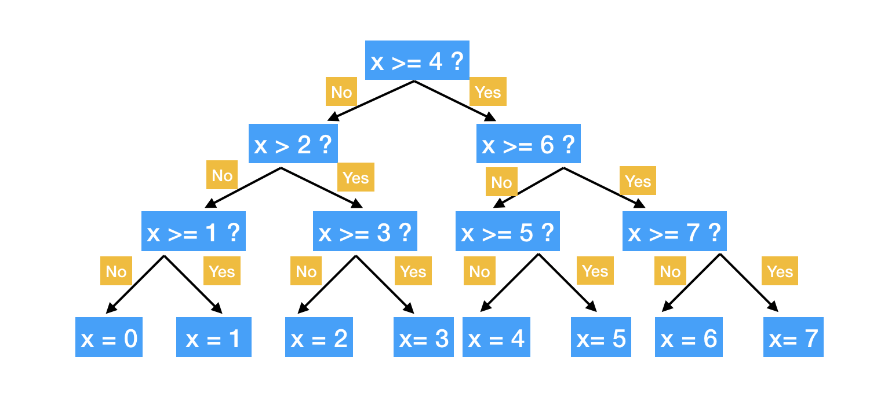

## Decision and Regression Trees: MLB Home Run Dataset

This project implements and analyzes Decision Trees and Regression Trees applied to a dataset of MLB hitters and home run data from FanGraphs.

## What are Decision Trees?

Decision trees are models used for the purpose of classification. They recursively split a dataset into smaller subsets based on specific features. Each subgroup contains mostly data points from a single class. The goal is to move from the original full dataset to one where each final group is as homogenous as possible.

When the model is determining the best splits, if a feature helps separate one classification from another/others, the tree will split the data based on a threshold in that feature. It continues making these splits as much as necessary.

The result is a flowchart-like structure where decisions are made by moving down branches from the root to a "leaf." 

Classification trees are easy to interpret because they follow similar logic to the decision-making processes that we obey as humans. 

_Image Credit / geeksforgeeks.org_

## What are Regression Trees?

Regression trees are similar to decision (classification) trees, but they make their predictions based around a continuous numerical value. They use mean squared error to decide how to split the data. At each node, the tree looks for a feature and a threshold that splits the data into two groups in a way that minimizes the overall variance of the target variable.

In my baseball example here, a model may find that setting a .300 threshold for BABIP leads to the most distinct difference in HR totals. After each split, the tree continues dividing the dataset based on other features (so in addition to the BABIP threshold from above, it forms a threshold for ISO, barrel rate, launch angle, and so on) until a stopping rule is triggered. The leaf nodes of the tree contain the average value of the target variable for the observations that fall into that group.

_Image Credit / scientistcafe.com_

## Dataset

I am using FanGraphs' hitters dataset from their leaderboards tool. All data was accumulated between Opening Day and the morning of June 25, 2025. This data is compiled by FanGraphs and Baseball Savant and is publicly available online for free. This dataset contains 160 observations with 69 features. Columns include counting stats, expected stats, rate stats, and more.

## Exploration

To implement the decision tree model, I am setting up a confusion matrix that compares the classification of high home run totals and low home run totals. I will use the features (explained below) to compare the true HR totals vs. predicted HR totals.

To implement the regression tree model, I am predicting home run totals of all 160 qualified MLB players. I will use the features (explained below) to predict the home run totals.

For feature selection, I am choosing a variety of features that would likely have some effect on home run prediction. I am using my existing knowledge of baseball and baseball analytics to figure out which features I should be using. Many of the features in my dataset pertain to non-power statistics, such as walk rate, baserunning metrics, and defensive metrics. While these may loosely relate to power (a lot of power hitters are less productive on defense), that is not always the case, so I made the decision to hand-pick features. 

Ultimately, I selected the following 16 features to predict home run total. Most of these features are statistics that indicate a player's ability to reach base when they put the ball in play, accrue total bases, hit the ball hard, hit the ball squarely, and hit the ball in the air. These are all requirements for a home run, so I am confident in using them as selected features to predict player home run totals.

Importantly, all players in this dataset are "qualified" (they meet MLB's playing time requirement to be statistically relevant), which means I am less likely to have fluky outliers, such as a player who only had one at-bat and managed to hit a home run with a low exit velocity. 

Selected Features: "ISO", "BABIP", "SLG", "wOBA", "wRC+", "BsR", "Off", "OPS", "xBA", "xSLG", "Hard%", "FB%", "EV", "LA", "Barrel%", "HardHit%"
