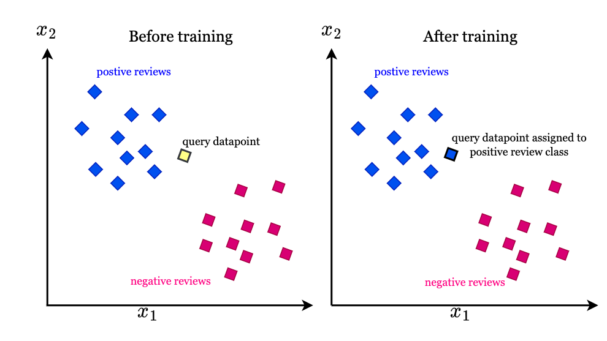

## K Nearest Neighbors: Fantasy Football Dataset

This project implements and analyzes K Nearest Neighbors applied to a dataset of NFL running backs, their data, and their fantasy point totals from 2024.

## What is KNN?

K-Nearest Neighbors is an intuitive and widely used machine learning algorithm to achieve classification and regression. 

KNN predicts the output for a new data point based on the outputs of its nearest neighbors in the feature space. “K” refers to the number of nearest neighbors the algorithm considers, and "NN" refers to nearest neighbors. For classification, the predicted class is typically the majority class among the nearest neighbors. For regression, the prediction is usually the average of the neighbors’ target values.

KNN relies on distance to find the nearest neighbors. Because of this, KNN can model complex decision boundaries when other models may not be able to. As a result, KNN depends heavily on the quality and scale of the features defined during feature selection.

One drawback to KNN is the process of selecting K (the number of nearest neighbors). A large K can take a while to process and result in reduced accuracy, but a small K can make the model sensitive to noise.

_Image Credit / Vrata Tech Solutions_

## Dataset

I am using Pro Football Focus' 2024 running back dataset from their fantasy football dashboard. This data is compiled by Pro Football Focus and available to paid subscribers. This dataset contains 145 observations with 20 features. Columns include counting stats and expected stats. 

## Exploration

For my exploration and implementation of KNN, I am using features (running backs' stats from 2024) to predict their fantasy football point totals. Then, I am comparing these predicted totals to their actual point totals.

As an extra component of this exploration, I am also implementing KNN to compare players' predicted totals to expected point totals, which is a statistic calculated by PFF. While the exact equation is unknown, I was curious if their process for estimating expected fantasy points resulted in similar totals to the point totals predicted by my KNN model. 

The five features I have selected are all common running back metrics: 'Receiving Rec', 'Receiving Yds', 'Receiving TD', 'Rushing Yds', 'Rushing TD'
