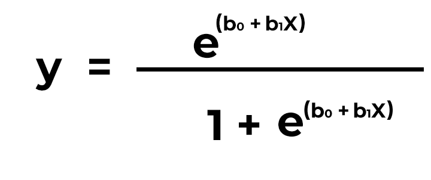
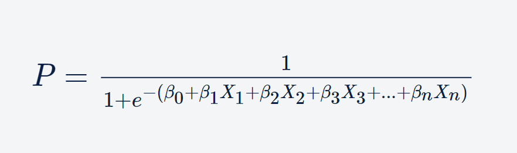

## Logsitic Regression: MLB Slugger Dataset

This project implements and analyzes Logsitic Regression applied to a dataset of MLB hitters' advanced metrics from Baseball Savant.

## What is Logistic Regression?

Logistic regression is a supervised machine learning algorithm that predicts the probability of a certain outcome through binary classification. The model determines probability through just two possible outcomes: 1/true, 2/false. 

By classifying every outcome as either true or false, logistic regression provides a clear prediction (essentially a yes/no or true/false) rather than a scale for a certain outcome. For example, if a student developed a logistic regression model to determine the probability of them being admitted into a certain college, they would receive a clear "yes" or "no" answer rather than an interpretable probability, like "78%."

The equation for logistic regression with one feature is:

The equation for logistic regression with multiple features is:

Logistic regression works best when the data in the dataset are linearly separable, which is the case with the example shown in this section. In my implementation of logistic regression here, I am analyzing a variety of features to predict whether the MLB players in the dataset will be classified as a power hitter. (For the sake of this implementation, I am classifying a "power hitter" as a .450+ slugging percentage.) This works because the outcome is going to be a binary observation. Rather than predicting their exact slugging percentage, I am predicting whether their status as a power hitter is "true" or "false."

## Dataset

I am using Baseball Savant's MLB hitter dataset from their hitting leaderboard. This data is compiled by Major League Baseball and publicly available online for free. This dataset contains 397 observations with 76 features.

## Exploration

The features used for this logistic regression include launch speed, launch angle, attack angle, swing path tilt, rate of ideal attack angles, horizontal distance between ball and batter at contact, and vertical distance between ball and batter at contact. 

For the sake of this project, a "power hitter" is defined as a hitter with a slugging percentage of at least .450, which means they average at least .45 bases per at-bat. 
