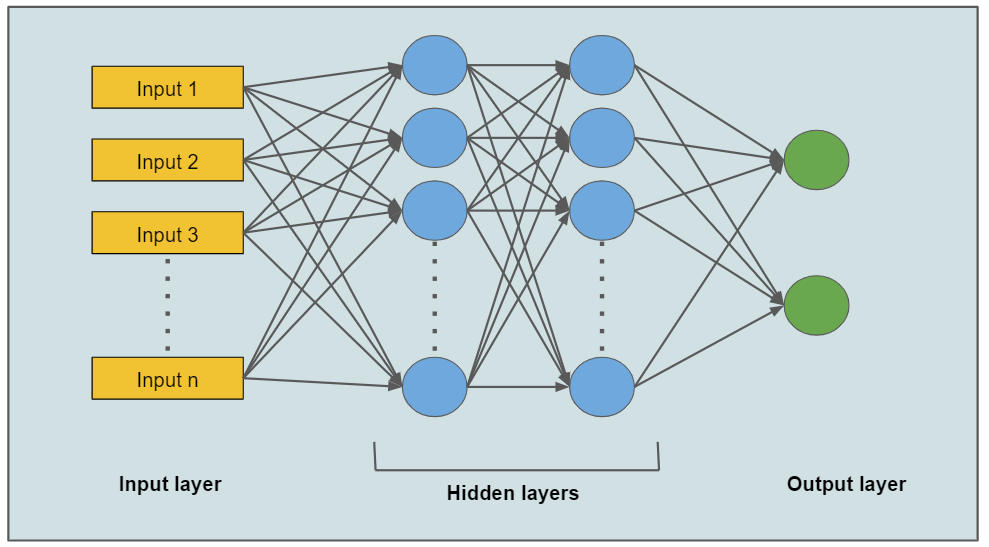

## Neural Networks: MLB Individual Game Data Set

This project implements and analyzes Neural Networks applied to a dataset of MLB individual game events from Baseball Savant.

## What are Neural Networks?

A neural network is a collection of neurons that use input data, process information from other nodes, and develop an output without programmed rules. 

A neural network is made up of densely connected processing nodes, and data science neural networks are intended to mirror the neural networks found in mammal brains. Each node within the network connects to other nodes, and together, they move data through the network in one direction. 

Neural networks make decisions by assigning each connected node to a weight, which represents the value of information assigned to an individual node. When a node receives information from other nodes, it calculates the total weight, and if that weight exceeds a certain threshold, the information is passed on to the next layer. If the weight is below the threshold, the information is not passed on.

A neural network is a corrective feedback loop, which means a larger weight is given to correct (true) predictions. This allows the model to develop increased accuracy over time.

_Image Credit: Ramya Vidiyala / Medium_

## Dataset

I am using Baseball Savant's game dataset from their direct gameday link for the Cubs vs. Mariners game on June 20, 2025. This data is compiled by Major League Baseball and publicly available online for free. This dataset contains 58 observations with 12 features.

## Exploration

The features used for this logistic regression include exit velocity, launch angle, hit distance, bat speed, pitch velocity, and expected batting average.
