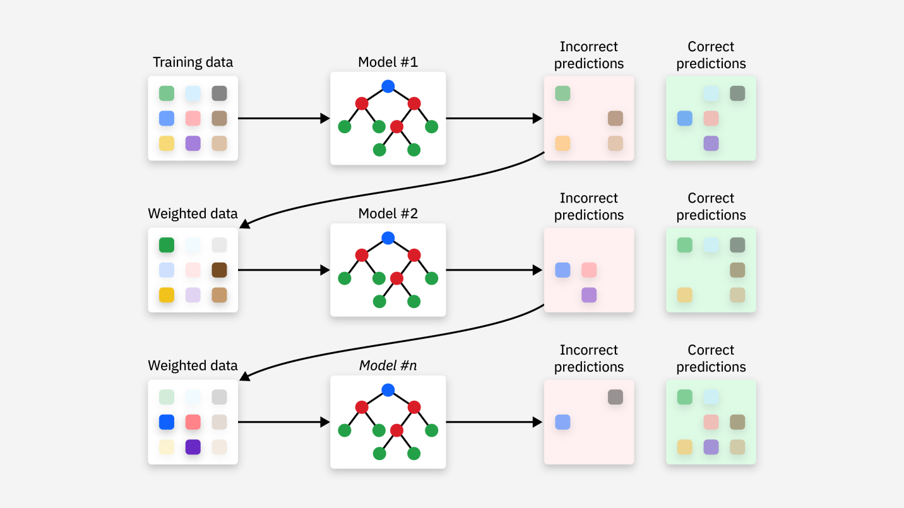

## Other Methods (Gradient Boosting): MLB Hitter Performance Dataset

This project implements and analyzes Gradient Boosting applied to a dataset of MLB hitter statistics from FanGraphs.

## What is Gradient Boosting?

Gradient Boosting Regressor (implemented as GradientBoostingRegressor from scikit-learn) is a machine learning model that sequentially builds decision trees. Unlike random forests, which build trees independently and average their results, gradient boosting builds one tree at a time. Each individual tree attempts to correct the errors made by the previous trees. Ideally, each new tree will be trained on the residuals, gradually achieving its accuracy and overall performance over time.

At each step in the training process, the model computes the mean squared error, then fits a shallow decision tree to this gradient. The new tree's predictions are scaled by a learning rate, which controls each tree's influence on the final prediction. A smaller learning rate equates to better generalization, but it requires more trees. 

_Image Credit: IBM_

## Dataset

I am using FanGraphs' hitters dataset from their leaderboards tool. All data was accumulated between Opening Day and the morning of June 25, 2025. This data is compiled by FanGraphs and Baseball Savant and is publicly available online for free. This dataset contains 160 observations with 69 features. Columns include counting stats, expected stats, rate stats, and more.

## Exploration

The features used for this exploration are: 'Barrel%', 'BB%', 'K%', 'HardHit%', 'Pull%', 'HR/FB'

The target feature is fWAR (FanGraphs' wins above replacement).
