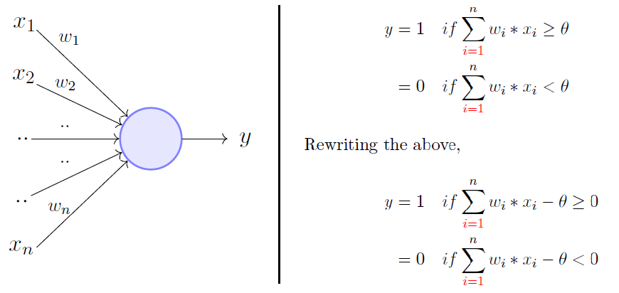

## Perceptron Classification: Breast Cancer Dataset

This project implements and analyzes the Perceptron algorithm applied to the breast cancer dataset from sklearn.

## What is Perceptron?

Perceptron is a simple classification algorithm. It builds a linear decision boundary separating two features by updating weights based on prediction errors. The boundary should be interpreted as a firm threshold between the two features.

In simpler terms, the perceptron model learns to separate data into two categories by finding a linear decision boundary that best divides the data points.

In this project, I am using the Perceptron Algorithm to classify whether a cancerous site is benign or malignant. I explore four different features in two different examples. The first uses the `worst perimeter` and `worst area` features. The second uses the `worst concavity` and `worst symmetry`.

A visualization/mapping of the Perceptron logic is shown below. 

_Image Source: Akshay L Chandr / Medium_

## Dataset

I am using the Breast Cancer Wisconsin dataset available in `sklearn.datasets`. This dataset contains 569 observations with 30 numerical features and a binary target (malignant or benign).

## Perceptron Model

- Written using NumPy, based off the implementation in our course module
- Trains with manually adjusted/defined learning rate and epoch count
- Visualizes decision boundaries and learning curves

## Exploration

- First attempt uses the features `worst perimeter` and `worst area` 
- Second attempt uses the features `worst concavity` and `worst symmetry` 
