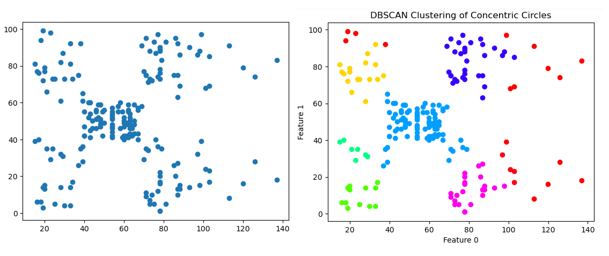

## DBSCAN: MLB Hitters Dataset

This project implements DBSCAN applied to a dataset of MLB hitters' statistics from Baseball Savant.

## What is DBSCAN?

DBSCAN is an unsupervised machine learning algorithm that identifies clusters in a dataset based on the density of data points. DBSCAN automatically determines the number of clusters based on eps (max distance between two neighbors) and minimum samples (minimum number of points required to form a dense region).

DBSCAN groups points together when they have a large number of neighbors within a specific radius. Clusters form from these groups of points.

DBSCAN is capable of identifying clusters of abnormal or arbitrary shape, which makes it valuable for real-world data that may not follow standard shapes. This gives DBSCAN an advantage over other unsupervised machine learning algorithms. It also gains an advantage because it is robust to noise.

The primary variables within DBSCAN are eps and min_samples, and changing these values or assigning them values that aren't ideal can drastically impact the results produced by implementing DBSCAN. If eps is too small, many points will be labeled as noise; if it's too large, clusters may be merged together when they aren't supposed to be merged. In my implementation here, I am using a k-distance plot to determine the appropriate eps value. 

_Image Credit: Amit Chauhan_

## Dataset

I am using Baseball Savant data from their custom hitter leaderboard tool. All data was accumulated between Opening Day and the morning of June 26, 2025. This data is compiled by Baseball Savant and is publicly available online for free. This dataset contains 162 observations with 10 features. 

## Exploration

I have selected seven features that adequately contextualize a hitter's performance over the course of the season. There is a mix of features that favor the hitter and pitcher; for example, a higher K% is good for the pitcher, but a higher BB% is worse for the pitcher. In full, though, the stats come together to provide a well-rounded understanding of a pitcher's performance.

The features used for this exploration are K%, BB%, OPS, Avg Exit Velo, Barrel%, HardHit%, and Sprint Speed. It's worth noting that this is one of the few cases where I used a baserunning metric in my analysis; I thought it could be beneficial to include in order to get an all-encompassing analysis and grouping of players.
