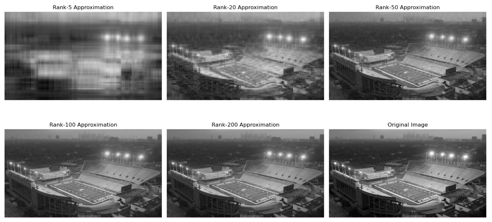

## Image Compression with Singular Value Decomposition: Rice Stadium Photos

This project implements Image Compression with Singular Value Decomposition applied to two photos from stadiums at Rice University.

## What is Image Compression with SVD?

Image Compression with Singular Value Decomposition (SVD) is a mathematical process that reduces the amount of data needed to represent an image while preserving as much visual information as possible. It works by decomposing the image matrix into three separate matrices such that the original image can be reconstructed by multiplying those three matrices together again. By keeping only the largest k singular values from one of the matrices (called S), we can create a lower-rank approximation that retains the most important features of the image while discarding less significant details.

In a grayscale image (2-D intensities), SVD provides an approximation that uses the top k singular values. The resulting compressed image will appear blurrier or less detailed for a low k value, but has a higher compression ratio. As k increases and more singular values are included, the compression ratio worsens, but the image becomes clearer with more fine details. 

For compression, storing k values from each of the three matrices takes up far less space than storing all original pixel values, especially for high-resolution images. This is why and how optimal compression ratios are achieved through SVD.

When dealing with color/RGB images (3-D intensities), SVD compression is applied separately to each channel. After compressing and reconstructing the red, green, and blue components individually, the image is then re-assembled back into its original appearance.

SVD-based compression offers a solution to situations where storage space is limited, such as websites, apps, mobile devices, or other disks/memory cards. SVD is a lossy compression method, which means that some information is discarded in the process, but it only loses the least important visual elements. The result is a smaller image that still maintains a very high visual quality. 

## Files

I am using two photos from athletic facilities at Rice University.
Reckling Park Photo Credit: Eric Moreno / Stadium Journey
Rice Stadium Photo Credit: Rice Athletics

## Exploration

I have chosen to implement Image Compression with SVD on two photos. One implementation will be on grayscale, and the other will be on a color (RGB) photo. 
