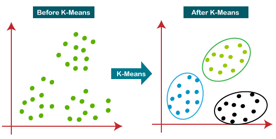

## K-Means Clustering: MLB Pitcher Dataset

This project implements K-Means Clustering applied to a dataset of MLB pitcher statistics from Baseball Savant.

## What is K-Means Clustering?

K-Means Clustering is an unsupervised machine learning algorithm that clusters data points into subgroups based on existing similarities. K-Means Clustering initializes a specified number of cluster centers and then assigns each data point to the nearest cluster center. After assigning points, the cluster centers are recalculated as the mean of all points inside that specific cluster. This process repeats until the clusters no longer change significantly.

The purpose of K-Means Clustering is to uncover hidden patterns that may not have previously been observed, either within the dataset or to the naked eye. It implements a technical process to distinctly cluster and group data points. Because of this, K-Means is especially useful when dealing with large datasets where manual labeling or inspection is not feasible. 

One drawback to K-Means Clustering is that it assumes clusters are equally sized and it is sensitive to outliers. This is why we implement the elbow method and silhouette score to determine the optimal K number of clusters for meaningful and interpretable clustering.

In my project, I am also including Principal Component Analysis. PCA can be looped into K-Means Clustering for visualization purposes, which is what I'm doing here. Whereas clustering is done in full-dimensional space, PCA helps project the results in 2D or 3D so that the clusters can be visualized clearly, as seen in my scatter plot with background regions.

_Image Credit: Pranshu Sharma_

## Dataset

I am using FanGraphs' hitters dataset from their leaderboards tool. All data was accumulated between Opening Day and the morning of June 25, 2025. This data is compiled by FanGraphs and Baseball Savant and is publicly available online for free. This dataset contains 160 observations with 69 features. Columns include counting stats, expected stats, rate stats, and more.

## Exploration

The features used for this exploration are: 'Barrel%', 'BB%', 'K%', 'HardHit%', 'Pull%', 'HR/FB'

The target feature is fWAR (FanGraphs' wins above replacement).

